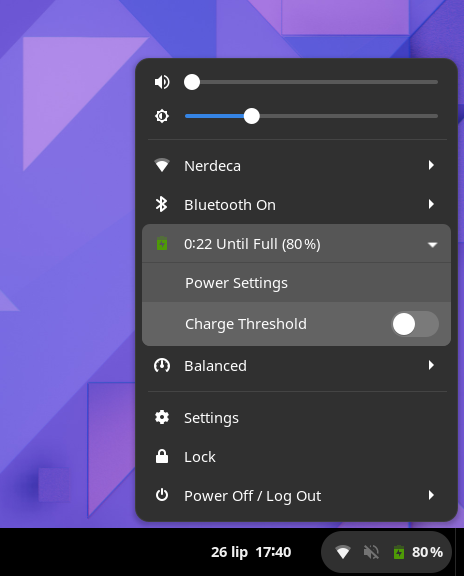

# GNOME Shell Extension: gnome-battery-charge-shell-extension
Adds switch for toggling ```gnome-battery-charge-threshold``` gsetting to the gnome-shell.
This is one of the ```gnome-battery-charge-manager``` integration package, therfore it is
required to have it installed (otherwise this extension will not work).

<p align="center">
  
</p>

# Installation

This version of extension was tested on GNOME 42.3 but there is high probability that it works from v40 up to main release.
```
  gnome-shell: '>= 42.3.0',
```

### Build & Install

Just copy extension folder & activate extension.
```
git clone https://github.com/Xoliper/gnome-battery-charge-shell-extension.git
cp -r gnome-battery-charge-shell-extension/gnome-battery-charge-shell-extension@xoliper.github.com ~/.local/share/gnome-shell/extensions/
... relog ...
gnome-extensions enable gnome-battery-charge-shell-extension@xoliper.github.com 
